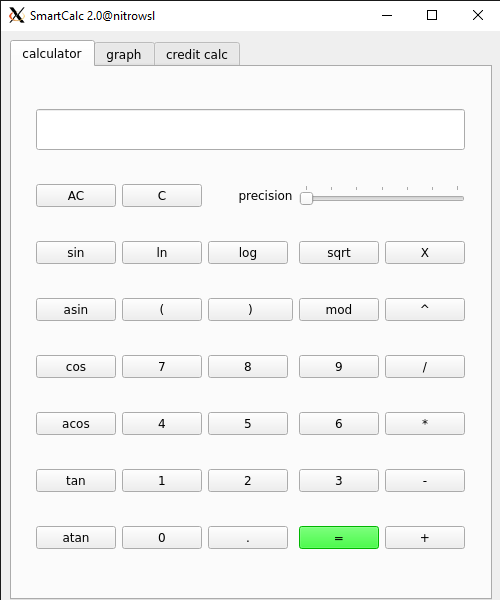
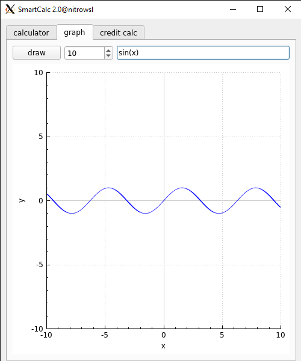
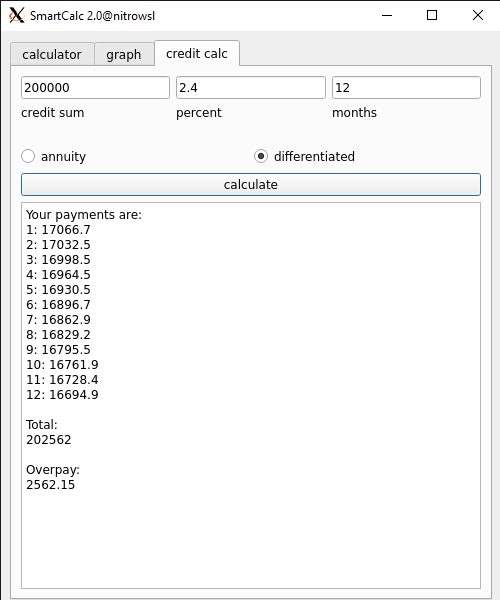

# SmartCalc v2.0

SmartCalc is a GUI application for calculating infix expressions.
Its functionality allows to build graphs f(x) and calculate loan payments.

For more information go src and run `make dvi`, then open **readme.pdf**

 
 
 
